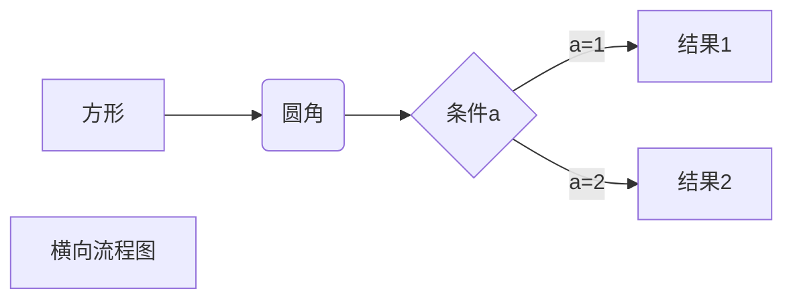
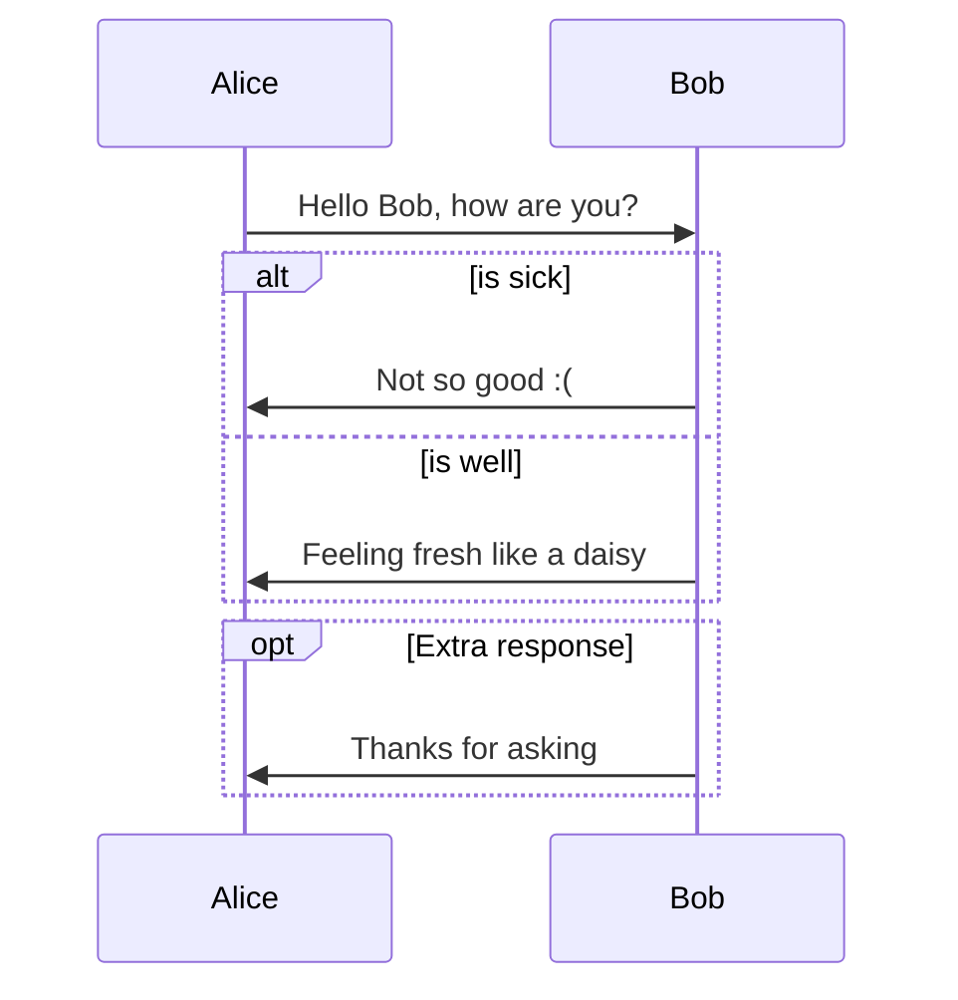

# $第$2节：食

```objective-c
int i = 0;
```


```flow 
graph TD;
    A-->B;
    A-->C;
    B-->D;
    C-->D;
```




```sequence
Alice->Bob: Hello Bob, how are you?
Note right of Bob: Bob thinks
Bob-->Alice: I am good thanks!
```



