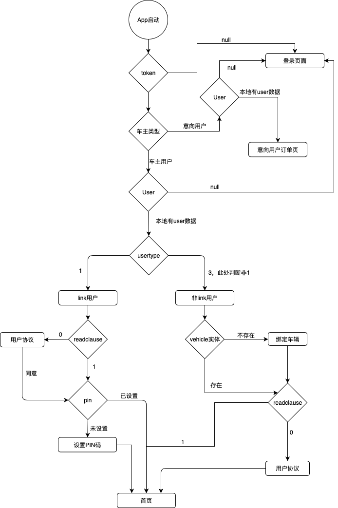

# 判断用户逻辑

#### 1.流程图



#### 2.代码逻辑

```objc
if (token.length==0 && !userModel) {//从未登录过
    
    //跳转到登录页面
    
} else {
    
    if (userModel.isCarUserLogin != 2) {
        
        if (token.length > 0 && userModel != nil) {//登录过，判断协议、车辆等信息是否已设置
        
            if (userModel.usertype == 1) { //link
                
                if (userModel.readclause == 0) {
                    //跳转到用户协议页面
                } else if ([vehicleModel.pin isNullString] || vehicleModel.pin == nil) {
                    //跳转到设置PIN码页面
                } else {
                    //跳转到首页
                }
                
            } else { //非link
                
                if (vehicleModel.vehicleid == nil || userModel.readclause == 0) {
                    //跳转到登录页
                } else {
                    //跳转到首页
                }
            }
            
        } else {
            //跳转到登录页
        }
        
    } else {
        //跳转到意向用户订单页
    }
}
```

