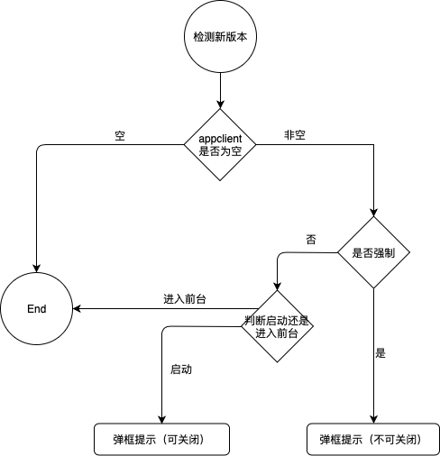

# 检测新版本

### 检测时机

+  App启动时（弹框提示）
+ 从后台进入前台时（非强制升级时不弹框提示）


#### 流程图





#### 代码逻辑

```objc
if (model != nil) {
    NSLog(@"有新版本");
    if (model.forcedupdate == 0) {//不强制
        if (isEnterForeground == NO) {
            //弹框提示（可关闭）
        } else {
            return;
        }
    } else { //强制升级
        //弹框提示（不可关闭）
    }
}
```

