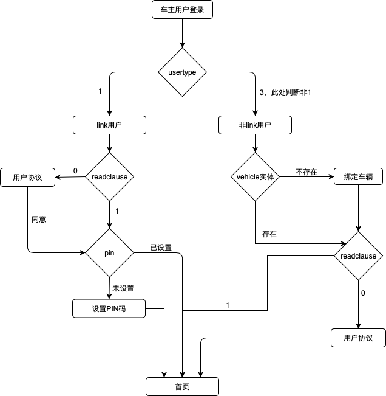
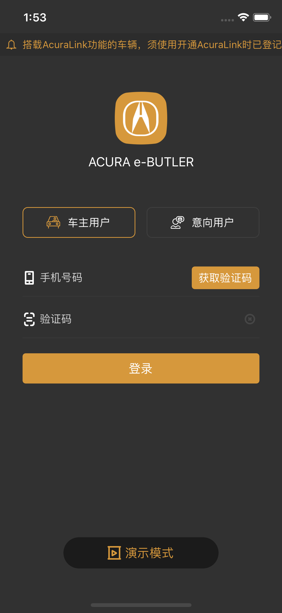
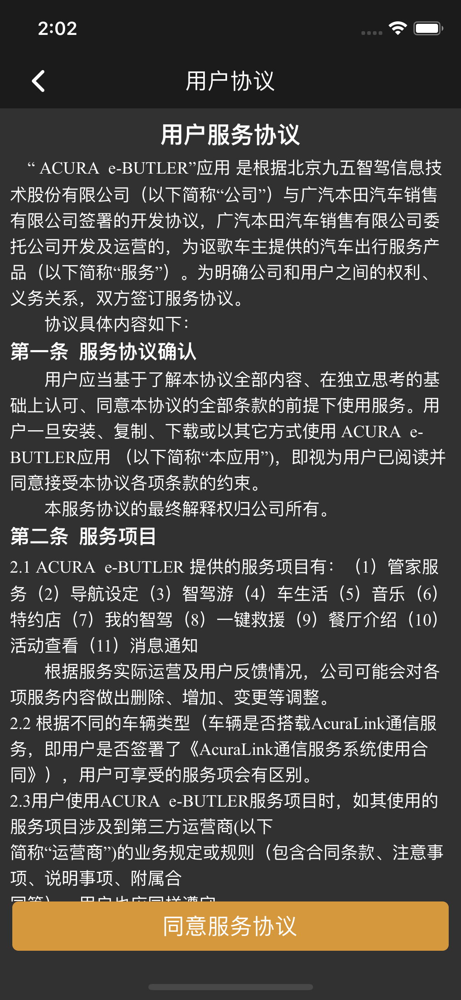
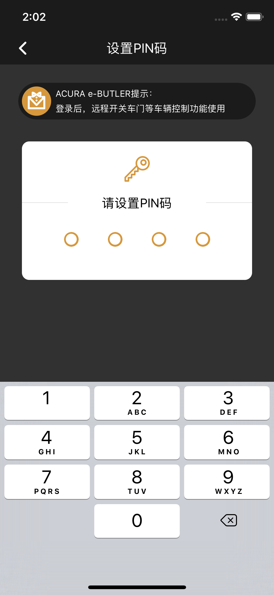
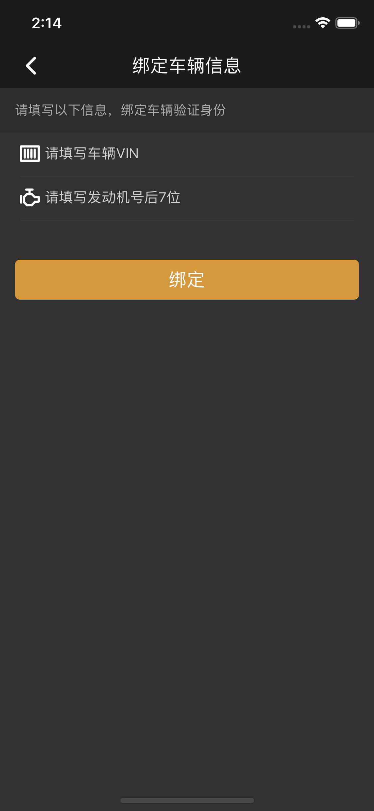

# 车主用户登录

#### 1.登录逻辑流程图



#### 2.登录页面截图



#### 3.登录逻辑代码

```objc
//页面逻辑顺序
//link用户：用户协议-> 设置PIN码 -> 首页
//非link用户：绑定车辆-> 用户协议 -> 首页
if (userModel.usertype == 1) {// link用户
    if (userModel.readclause == 0) {
        NSLog(@"link未阅读协议，进入阅读协议页面");
    } else if (vehicleModel.pin == nil || [vehicleModel.pin isNullString]) {
        NSLog(@"link未设置PIN码，进入设置PIN码页面");
    } else {
        NSLog(@"link正常进入首页");
    }
    
} else {// 非link用户  usertype==3,暂时用非1来做判断
    if (vehicleModel.vehicleid == nil) {
        NSLog(@"非link未绑定车辆，进入绑车页面");
    } else if (userModel.readclause == 0) {
        NSLog(@"非link未阅读协议，进入阅读协议页面");
    } else {
        NSLog(@"非link正常进入首页");
    }
}
```


#### 4.保存用户相关信息

```objc
// 保存token
NSString * token = response[@"token"];
[HSUserDefaults doSetUserDefaults:[NSNumber numberWithBool:YES]  withKey:kUserDefaultsForShowTrackPhoto];
[HSUserDefaults doSetUserDefaults:token withKey:kUserDefaultsForToken];

// 保存user
ACUserModel * userModel = [ACUserModel modelWithDictionary:response[@"userinfo"]];
userModel.isCarUserLogin = 1;
NSData * userData = [NSKeyedArchiver archivedDataWithRootObject:userModel];
[HSUserDefaults doSetUserDefaults:userData withKey:kUserDefaultsForUser];
[ACUserProxy share].user = userModel;

// 保存vehicle
ACVehicleModel * vehicleModel = [ACVehicleModel modelWithDictionary:response[@"vehicle"]];
NSData * vehicleData = [NSKeyedArchiver archivedDataWithRootObject:vehicleModel];
[HSUserDefaults doSetUserDefaults:vehicleData withKey:kUserDefaultsForVehicle];
[ACVehicleProxy share].vehicle = vehicleModel;

// 保存mirror
ACMirrorModel * mirrorModel = [ACMirrorModel modelWithDictionary:response[@"mirror"]];
NSData * mirrorData = [NSKeyedArchiver archivedDataWithRootObject:mirrorModel];
[HSUserDefaults doSetUserDefaults:mirrorData withKey:kUserDefaultsForMirror];
[ACMirrorProxy share].mirror = mirrorModel;
```


#### 5.阅读协议截图



#### 6.设置PIN码截图



#### 7.设置PIN码逻辑

1.输入两遍以4位数字组成的PIN码，如两次输入不一致，提示用户 `"两次输入不一致，请重新输入"`

2.PIN码不能设置过于简单，不能设置为连续的数字或者相同的数字


#### 8.非link用户绑定车辆截图



